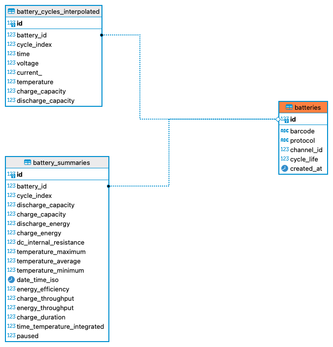

# Data-Driven for Solar Battery

## Raw Data Source

The battery cycling data is sourced from [data.matr.io/1](https://data.matr.io/1/), which provides comprehensive battery cycling datasets for research and analysis.

## Database Structure

### Tables Description

#### `batteries` Table

This table stores the core information about each battery unit:

- **id**: Unique identifier for each battery in the database (primary key)
- **barcode**: Unique manufacturer barcode for the battery (used for identification)
- **protocol**: The charging/discharging protocol used for cycling the battery
- **channel_id**: The testing channel identifier where the battery was cycled
- **cycle_life**: The total number of cycles the battery completed before failure
- **created_at**: Timestamp when the battery record was created in the database

Purpose: Serves as the central reference point for all battery-related data, with other tables linking to it via foreign keys.

#### `battery_summaries` Table

This table contains summary metrics for each cycle of a battery:

- **id**: Unique identifier for each summary record
- **battery_id**: Reference to the battery this summary belongs to (foreign key)
- **cycle_index**: The cycle number this summary data represents
- **discharge_capacity**: Discharge capacity measured in Ah
- **charge_capacity**: Charge capacity measured in Ah
- **discharge_energy**: Energy released during discharge in Wh
- **charge_energy**: Energy consumed during charge in Wh
- **dc_internal_resistance**: DC internal resistance in ohms
- **temperature_maximum**: Maximum temperature recorded during the cycle in °C
- **temperature_average**: Average temperature during the cycle in °C
- **temperature_minimum**: Minimum temperature during the cycle in °C
- **date_time_iso**: Timestamp when the cycle was completed
- **energy_efficiency**: Ratio of discharge energy to charge energy
- **charge_throughput**: Cumulative charge throughput up to this cycle
- **energy_throughput**: Cumulative energy throughput up to this cycle
- **charge_duration**: Duration of the charging phase in seconds
- **time_temperature_integrated**: Time-temperature integral for the cycle
- **paused**: Flag indicating if the cycle was paused (1) or not (0)

Purpose: Provides cycle-level performance metrics that summarize each complete charge-discharge cycle, enabling analysis of battery degradation over time.

#### `battery_cycles_interpolated` Table

This table stores detailed time-series measurements within each cycle:

- **id**: Unique identifier for each data point
- **battery_id**: Reference to the battery this data belongs to (foreign key)
- **cycle_index**: The cycle number this data point belongs to
- **time**: Time point within the cycle in seconds
- **voltage**: Battery voltage at this time point in volts
- **current_**: Current at this time point in amps
- **temperature**: Temperature at this time point in °C
- **charge_capacity**: Charge capacity at this time point in Ah
- **discharge_capacity**: Discharge capacity at this time point in Ah

Purpose: Contains high-resolution time-series data for each cycle, allowing detailed analysis of battery behavior during charging and discharging phases. This data is sampled (every 10th point) to reduce database size while maintaining the important patterns in the data.

## Data Ingestion Process

The data ingestion process reads JSON files from a specified folder and inserts the data into the PostgreSQL database according to the schema above. The process is managed by PM2 to ensure continuous operation and proper error handling.

Each JSON file contains data for a single battery, including:
- Battery metadata (barcode, protocol, channel_id)
- Summary metrics for each cycle
- Interpolated time-series data for detailed analysis

The ingestion script automatically detects the structure of the JSON data and handles both nested and flattened data formats.